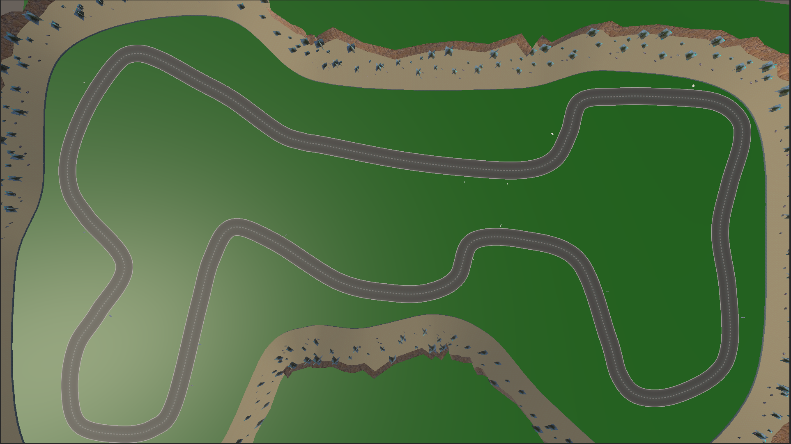

# Reinforcement Racing

<p align="center">
  
</p>

A cutting-edge Unity racing game featuring AI opponents trained through deep reinforcement learning. Race against neural networks that learn optimal racing lines, adapt to different tracks, and recover from mistakes without human intervention.

## 🏎️ Overview

Reinforcement Racing combines realistic vehicle physics with state-of-the-art machine learning to create a unique racing experience. The AI opponents aren't programmed with traditional racing algorithms - they learn through millions of iterations of trial and error, developing their own racing strategies and techniques.

## ✨ Key Features

### Advanced AI Racing Agents
- **Self-learning AI** trained using Proximal Policy Optimization (PPO)
- **Neural network architecture** with 3 hidden layers (512 units each) and LSTM memory
- **Sophisticated observation system** using raycasts to perceive track boundaries
- **Adaptive racing behavior** that improves with training time
- **Recovery capabilities** allowing AI to return to track after collisions or mistakes

### Racing Experience
- **Multiple race tracks** with varying difficulty and complexity
- **Realistic vehicle physics** using Unity's physics engine
- **Two game modes**: Race against AI or Watch Mode to observe AI behavior
- **Detailed visualization tools** in Watch Mode to see what the AI perceives

### Technical Implementation
- **Built with Unity ML-Agents framework** for reinforcement learning
- **Continuous action space** for smooth control (steering, acceleration, braking)
- **Reward system** that encourages speed, track adherence, and lap completion
- **Checkpoint system** for progress tracking and lap timing
- **Customizable training parameters** via Unity Inspector

## 🎮 Game Modes

### Race Mode
Challenge the AI in a head-to-head race! Test your driving skills against a neural network that's been trained for millions of steps.

### Watch Mode
Observe the AI in action with detailed visualization options:
- Track boundary visualization
- Raycast perception display
- Checkpoint visualization
- Real-time telemetry data

## 🧠 Reinforcement Learning Details

The AI agents in Reinforcement Racing are trained using:

- **PPO Algorithm**: A state-of-the-art policy gradient method
- **LSTM Memory**: Allows the agent to remember past states and make better decisions
- **Custom Reward Functions**: Carefully balanced to encourage:
  - High speed on straightaways
  - Proper braking and cornering
  - Staying on track
  - Completing laps in minimum time
  - Recovering from mistakes

The training process involves:
1. Agents exploring the track through trial and error
2. Receiving rewards/penalties based on their actions
3. Gradually improving their policy (decision-making strategy)
4. Learning from millions of racing iterations

## 🚀 Getting Started

### Prerequisites
- Unity 2022.3 LTS or newer
- Basic understanding of Unity interface

### Installation
1. Clone this repository:
   ```
   git clone https://github.com/kolin-nielson/ReinforcmentRacing.git
   ```
2. Open the project in Unity
3. Open one of the track scenes in the Assets/Scenes folder
4. Press Play to start racing!

## 🛠️ Technical Architecture

The project is structured around several key components:

- **RacingAgent**: ML-Agents implementation for the AI driver
- **VehicleController**: Handles vehicle physics and controls
- **CheckpointSystem**: Manages race progress and lap timing
- **TrackBoundaryDetector**: Helps the AI understand track limits
- **GameModeManager**: Switches between Race and Watch modes
- **Visualization Tools**: For debugging and observing AI behavior

## 📊 Training Your Own AI

Advanced users can train their own AI agents:

1. Install Python and ML-Agents package
2. Configure training parameters in `racing_config.yaml`
3. Run training with:
   ```
   mlagents-learn racing_config.yaml --run-id=your_run_name
   ```
4. Monitor progress with TensorBoard
5. Test intermediate models during training

## 📝 License

This project is licensed under the MIT License - see the LICENSE file for details.

## 🙏 Acknowledgments

- Unity ML-Agents team for the reinforcement learning framework
- Ash Assets for the Sim-Cade Vehicle Physics system
